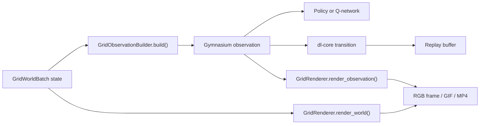

# deep-learning-robotics

Fast, reproducible 2D robotics environments for
[`deep-learning-core`](https://github.com/Blazkowiz47/dl-core).

## Install

```bash
pip install deep-learning-robotics
```

Version `0.0.3` requires `deep-learning-core>=0.0.28,<0.1`.

## What's New in 0.0.3?

- `dl-init --with-robotics` now adds `deep-learning-robotics`, a runnable
  `configs/robotics.yaml`, and organized `environments`, `rules`, `scenarios`,
  `callbacks`, and `episode_managers` packages to a normal dl-core experiment
- `dl-robotics add environment|rule|scenario NAME` creates robotics-specific
  local components without replacing dl-core's existing generators for models,
  trainers, callbacks, and episode managers
- interaction rules can be selected by registered name or YAML mapping while
  existing programmatic `InteractionRule` instances remain supported

Previous versions are recorded in the [release history](RELEASES.md).

## Environment Configuration

Import `dl_robotics` once to register its environments, then use normal
dl-core configuration:

```yaml
environment:
  name: robotics_mapf_vector
  num_envs: 16
  scenario:
    name: crossing
    width: 7
    height: 7
    max_steps: 40
    walls: [[3, 1], [3, 5]]
    starts: [[1, 1], [5, 5]]
    goals: [[5, 5], [1, 1]]
  rewards:
    step: -0.01
    progress: 0.1
    collision: -0.25
    goal: 1.0
    success: 5.0
  interaction_rule:
    name: exclusive_cell
  render:
    cell_size: 48
    show_grid: true

episode_managers:
  robotics:
    capture_phases: [evaluation]
    capture_every_n_episodes: 1
    max_captured_episodes: 20
    media_format: both
    fps: 8
```

Each actor chooses one of `stay`, `up`, `right`, `down`, or `left`. The
centralized environment encodes all actor choices into one
`Discrete(5 ** num_agents)` joint action, with actor zero stored in the least
significant base-5 digit. This is intentionally aimed at small cooperative
MAPF problems; larger or decentralized systems should use a future multi-agent
policy API instead of an exponentially growing joint action.

The image observation is suitable for DQN and PPO. dl-core's tabular
Q-learning trainer requires a `Discrete` observation space, so it is not
compatible with this first image-observation environment.

## Project Scaffolding

Install `deep-learning-robotics` alongside dl-core, then use the same project
initializer:

```bash
dl-init --name warehouse-mapf --with-robotics --no-prompt
cd warehouse-mapf
uv sync
uv run dl-run --config configs/robotics.yaml --validate-only
```

The robotics extension preserves the usual dl-core layout and adds only the
domain-specific folders:

```text
src/
├── bootstrap.py
├── callbacks/
├── environments/
├── episode_managers/
├── models/
├── rules/
└── scenarios/
```

Use dl-core's `dl-core add` command for models, trainers, callbacks, and episode
managers. Use the robotics command for environment-domain components:

```bash
dl-robotics add environment warehouse
dl-robotics add rule priority
dl-robotics add scenario crossing
```

Each generated module is imported from its package `__init__.py`, so
`src/bootstrap.py` can import the package once during local component loading.

The observation is a float32 tensor with shape `[7, height, width]`: walls,
actor identity, goal identity, row/column velocity, and row/column acceleration.
Episode info exposes `is_success`, collision counts, reached agents, makespan,
sum of costs, and total path length for episode managers and experiment
tracking. `collisions` and its typed variants describe the latest step;
`episode_collisions` and its typed variants retain the episode totals.

## Controlling Model Observations

Model input and visual media are deliberately separate:



`build_observation()` and `build_observations()` on the environment return
exactly what is sent to the model and, for off-policy trainers, stored as
`observation` and `next_observation` in replay. The default registered
`semantic_grid` builder produces the seven channels described above.

Researchers can register a different observation space and construction
without changing stepping, rewards, or the trainer. Standard semantic and RGB
layouts also work with the default renderer; unusual layouts need a matching
registered renderer:

```python
import gymnasium as gym
import numpy as np
from dl_robotics import GridObservationBuilder, register_observation_builder


@register_observation_builder("actor_goal_masks")
class ActorGoalMasks(GridObservationBuilder):
    def _observation_space(self, scenario):
        return gym.spaces.Box(
            low=0.0,
            high=1.0,
            shape=(3, scenario.height, scenario.width),
            dtype=np.float32,
        )

    def _build(self, world):
        observations = np.zeros(
            (
                world.num_worlds,
                3,
                world.scenario.height,
                world.scenario.width,
            ),
            dtype=np.float32,
        )
        observations[:, 0] = world.wall_mask
        for world_index in range(world.num_worlds):
            row, column = world.positions[world_index, 0]
            observations[world_index, 1, row, column] = 1.0
        goal_row, goal_column = world.goal_positions[0]
        observations[:, 2, goal_row, goal_column] = 1.0
        return observations
```

Select it independently for training and evaluation:

```yaml
environment:
  observation_builder:
    name: actor_goal_masks
```

Custom builders inherit `GridObservationBuilder` and implement only
`_observation_space()` and `_build()`. The built-in MAPF environments currently
expect batched NumPy arrays. RGB builders can therefore return
`[num_envs, height, width, 3]`, while semantic builders can choose their own
channel layout. The returned values, declared Gymnasium space, model, and
selected dl-core trainer must agree.

For shape-controlled RGB model input, use the built-in `rendered_grid` builder.
These pixels—not merely the GIF appearance—are then stored in replay:

```yaml
environment:
  observation_builder:
    name: rendered_grid
    output_size: 256
    actor_shape: triangle
    goal_shape: circle
    show_actor_ids: false
```

When `output_size` is set, walls and fixed goals are rasterized and cached
directly at that resolution. Actors are then drawn at the same resolution with
a minimum visible marker size. A 1000×1000 world targeting 256×256 therefore
does not allocate a cell-scaled 16000×16000 intermediate image.
`output_size` supersedes `cell_size`; grid lines are automatically omitted when
individual cells would be less than four pixels wide. Actor IDs are omitted
when their marker is too small to keep the pixels legible.

The default episode renderer understands the default semantic layout and
passes HWC `uint8` RGB observations through unchanged. A custom semantic layout
whose first three channels are not walls, actors, and goals should be paired
with a custom registered renderer.

## Rendering and Episode Artifacts

`environment.render()` returns RGB `uint8` arrays without opening a display:
`[height, width, 3]` for the scalar environment and
`[num_envs, height, width, 3]` for the vector environment.

Rendering configuration changes media only; it does not change model input:

```yaml
environment:
  render:
    name: grid
    cell_size: 32
    show_grid: true
    actor_shape: triangle
    goal_shape: circle
    show_actor_ids: false
```

Actors are solid and goals are hollow. Both support `circle`, `square`, and
`triangle`. For research-specific symbols, subclass `GridRenderer`, override
`_draw_actor()` or `_draw_goal()`, register it with
`@register_grid_renderer("my_renderer")`, and select that name under `render`.
Override `_render_observation()` only when the full RGB composition needs to
change. Episode artifacts have their own component configuration because they
render stored historical observations:

```yaml
episode_managers:
  robotics:
    renderer_name: my_renderer
    actor_shape: triangle
    goal_shape: circle
```

The `robotics` episode manager includes dl-core's standard episode metrics and
trajectory capture, so it should be used in place of the `standard` manager.
For selected phases and episode intervals it stores the complete compressed
trajectory and optionally a GIF, MP4, or both. It also emits
`robotics/collisions`, typed collision counts, reached fraction, makespan,
sum of costs, and path length through normal callback and tracker flows.

Media files can also be created directly:

```python
from dl_robotics import write_animation

write_animation("episode.gif", frames, fps=8)
write_animation("episode.mp4", frames, fps=8)
```

## Interaction Rules

`GridWorldBatch` owns numerical state, while `InteractionRule` owns how proposed
movements interact. `ExclusiveCellRule` provides MAPF-safe defaults. A custom
rule can be registered and selected from normal YAML:

```python
from dl_robotics import ExclusiveCellRule, register_interaction_rule


@register_interaction_rule("priority")
class PriorityRule(ExclusiveCellRule):
    """Replace or extend conflict handling for this experiment."""
```

```yaml
environment:
  interaction_rule:
    name: priority
```

The short form `interaction_rule: exclusive_cell` is equivalent. Existing
`InteractionRule` objects can still be supplied when constructing an
environment programmatically. Rule mappings are passed to the registered
class's `from_config()` method, so configurable rules can validate their own
serializable fields without changing environment or trainer code.

The first version uses vectorized geometry and preallocated state arrays, with
small per-world conflict-resolution loops where agent dependencies require
them. It does not model continuous rigid-body dynamics, ROS, Gazebo, or 3D
simulation.

## Shortest-Path Baselines

Use A* for efficient exact planning on the unit-cost grid, or Dijkstra when a
heuristic-free reference is useful:

```python
from dl_robotics import (
    GridScenario,
    astar_path,
    bfs_path,
    dfs_path,
    dijkstra_path,
)

scenario = GridScenario(
    width=5,
    height=5,
    starts=((0, 0), (4, 4)),
    goals=((4, 4), (0, 0)),
    walls=((1, 2), (3, 2)),
)

astar = astar_path(scenario, scenario.starts[0], scenario.goals[0])
dijkstra = dijkstra_path(scenario, scenario.starts[1], scenario.goals[1])
bfs = bfs_path(scenario, scenario.starts[0], scenario.goals[0])
dfs = dfs_path(scenario, scenario.starts[1], scenario.goals[1])
```

Paths include both endpoints and use four-direction movement around static
walls. Their move count is therefore `len(path) - 1`. A*, Dijkstra, and BFS
return shortest paths on this unweighted grid. DFS returns the first
depth-first route and does not guarantee optimality. Traversal ties use the
fixed up, right, down, left order. The exact planners provide per-agent lower
bounds and deterministic evaluation baselines; independently planned paths can
still have vertex or edge conflicts and are not, by themselves, a multi-agent
path-finding solver.
